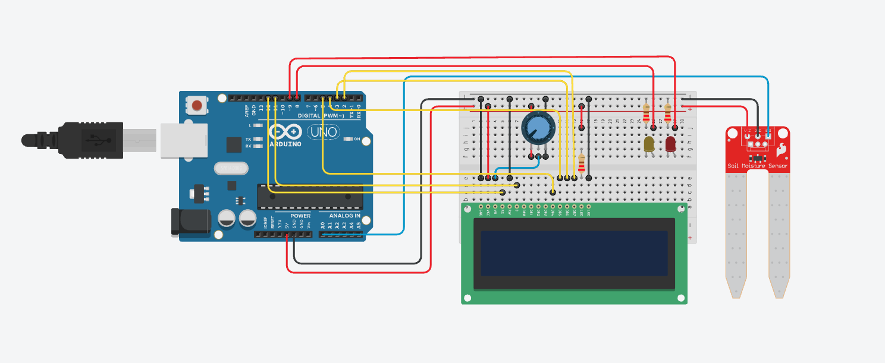

# Plant Monitor

## An program witten in ArduinoIDE to monitor plants. Uses Arduino UNO R3, Soil Moisture Sensor, DHT11, LEDs, and LCD Monitor

### **HARDWARE**
+ Arduino Board
+ LCD1602 Screen
+ 10k ohm Potentiometer
+ 220 ohm Resistor
+ Hook-up wires
+ Breadboard
+ Yellow LED
+ Red LED
+ DHT11
+ Soil Moisture Sensor

### **CIRCUIT**
+ LCD RS pin to digital pin 12
+ LCD Enable pin to digital pin 11
+ LCD D4 pin to digital pin 5
+ LCD D5 pin to digital pin 4
+ LCD D6 pin to digital pin 3
+ LCD D7 pin to digital pin 2
+ LCD R/W pin to GND
+ LCD VSS pin to GND
+ LCD VCC pin to 5V
+ LCD LED+ to 5V through a 220 ohm resistor
+ LCD LED- to GND
+ Potentiometer to GND and 5V
+ Potentiometer wiper to LCD V0 pin
+ DHT11 GND pin to GND
+ DHT11 VCC to 5V
+ DHT11 DATA to digital pin 7
+ Soil Moisture Sensor VCC to 5V
+ Soil Moisture Sensor GND to GND
+ Soil Moisture Sensor AO to analog pin A0
+ Red LED Anode to digital pin 9
+ Red LED Cathode to GND
+ Yellow LED Anode to digital pin 8
+ Yellow LED Cathode to GND

#

*Note: The DHT11 temperature and humidity sensor is not included in this diagram, but should be connected to the Arduino as described in the documentation.*

#
### **How it works**
The DHT sensor reads in the environmental humidity and temperature, then the arduino outputs the collected values and outputs them via the liquid crystal display. The soil moisture sensor has two prongs that once inserted into soil, will read the value of the moisture within the soil. The value from the sensor I used anywhere from 300 to 1023 (300 meaning very wet, and 1023 meaning very dry). The LEDS would then be triggered on based off the value. Red for dry, yellow for moderate dryness, and both off for healthy soil.
#

